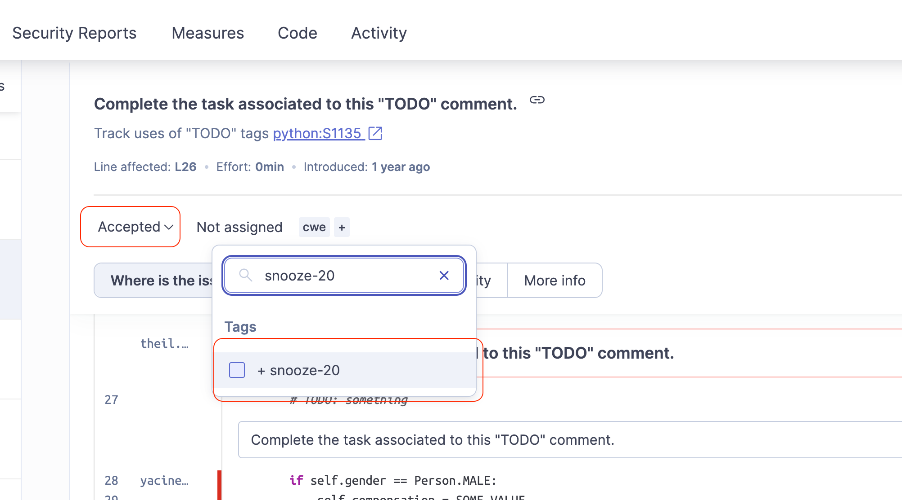

# SonarQube Issue Snooze Script

This script is designed to be run as a cron job on a server with access to a SonarQube instance. It automates the process of "unsnoozing" SonarQube issues that have been snoozed using tags.

## Purpose

SonarQube issues can be marked "accepted" and tagged with `snooze` or `snooze-{days}` to temporarily postpone addressing them. This script periodically checks these snoozed issues and automatically reopens them if their snooze period has expired.  It also removes the snooze tag after processing.

## Prerequisites

* **Python 3.6+**
* **`requests` library:** You can install it using `pip install requests`
* **`python-dotenv` library:** You can install it using `pip install python-dotenv`
* **SonarQube instance**
* **SonarQube API token:** You'll need a SonarQube API token with permissions to search issues, view issue changelogs, transition issues, and manage issue tags.

## Installation

1.  **Clone the repository:**
    ```bash
    git clone <repository_url>
    cd <repository_directory>
    ```
2.  **Set up environment variables:**
    * Create a `.env` file in the same directory as the script.
    * Add the following variables to the `.env` file, replacing the placeholders with your actual values:

        ```
        SONAR_TOKEN=<your_sonarqube_api_token>
        SONARQUBE_URL=<your_sonarqube_url>
        DEFAULT_SNOOZE_DAYS=30          # Default snooze period in days
        ```
3.  **Install dependencies:**
    ```bash
    pip install -r requirements.txt 
    ```

## Usage

1.  **Tagging Issues in SonarQube:**

    * **`snooze` tag:** Tag an issue with `snooze` to snooze it for the default number of days (defined by `DEFAULT_SNOOZE_DAYS` in the `.env` file, which defaults to 30 days).
    * **`snooze-{days}` tag:** Tag an issue with `snooze-XX` (e.g., `snooze-15`, `snooze-90`) to snooze it for a specific number of days.  For example, `snooze-15` will snooze the issue for 15 days.

    

2.  **Running the Script:**

    * You can run the script manually from the command line:

        ```bash
        python snooze_issues.py
        ```

3.  **Setting up as a Cron Job:**

    * To automate the process, set up a cron job to run the script periodically.
    * Open your crontab file:

        ```bash
        crontab -e
        ```

    * Add a line similar to the following to run the script daily at 3:00 AM (adjust the path and schedule as needed):

        ```
        0 3 * * * python /path/to/your/snooze_issues.py
        ```

    * **Important:** Ensure that the user running the cron job has the correct permissions to execute the script and access the `.env` file.  It is recommended to use absolute paths to avoid any issues with cron's environment.

## Script Functionality

1.  **Issue Retrieval:** The script uses the SonarQube API to retrieve all issues with the status "ACCEPTED" and filters these to tags matching "snooze*"
2.  **Snooze Period Calculation:**
    * If the tag is simply `snooze`, the snooze period is taken from the `DEFAULT_SNOOZE_DAYS` environment variable.
    * If the tag is in the format `snooze-{days}`, the number of days is extracted from the tag.
3.  **Resolution Date Check:** The script uses the SonarQube API to get the changelog for the issue and determines the date when the issue was marked as "ACCEPTED" (resolved).
4.  **Snooze Expiration Check:** It calculates the snooze expiration date by adding the snooze period to the resolution date. If the current date is past the expiration date, the script will reopen the issue using the API and remove the tag.


## Important Notes

* **Error Handling:** The script includes basic error handling to catch exceptions during API calls. Check your cron job logs for any error messages.
* **Permissions:** Make sure the user generating the SonarQube API token has sufficient permissions to perform the necessary actions. (Browse Projects, Admister Issues on all projects at the very least or a gloabl admin token will also work)
* **Pagination:** The script uses pagination to retrieve issues from SonarQube. The page size can be adjusted in the `get_issues` function if needed.
* **Time Zones:** The script uses timezone-aware datetime objects when comparing dates.  Ensure your server and SonarQube instance are configured with the correct time zones to avoid unexpected behavior.
* **Testing:** Test the script thoroughly in a development or staging environment before deploying it to production.  You can test it manually by running it from the command line and verifying the results in your SonarQube instance.
* **Cron Job Logging:** Check your cron job's logs to ensure the script is running correctly and to identify any errors.  Cron logs are typically located in `/var/log/syslog` or `/var/log/cron`, but the location may vary depending on your system.  You can redirect the script's output to a log file by modifying your cron entry:

    ```
    0 3 * * * python /path/to/your/snooze_issues.py >> /var/log/snooze_issues.log 2>&1
    ```

## Disclaimer

This script is provided as-is, and you are responsible for testing and ensuring its suitability for your environment. 
